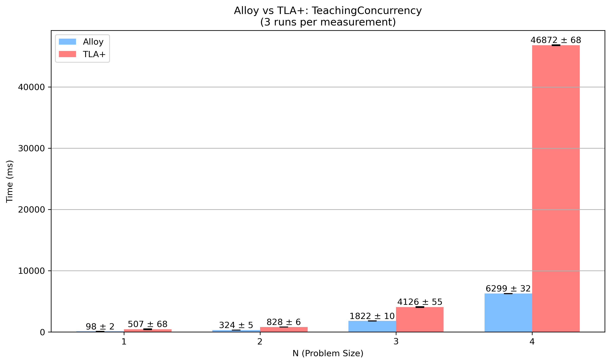

# Echo Algorithm

## Overview
This specification models the Echo algorithm, a simple distributed algorithm for information dissemination in a network. The algorithm was originally specified in TLA+ by Stephan Merz.

## Description
The Echo algorithm works as follows:

1. An initiator node sends a message to all its neighbors
2. When a non-initiator node receives a message for the first time:
   - It marks the sender as its parent
   - It sends messages to all its neighbors except its parent
3. When a node receives messages from all its neighbors, it sends an acknowledgment (echo) back to its parent
4. The algorithm terminates when the initiator receives acknowledgments from all its neighbors

This algorithm is used for:
- Spanning tree construction
- Broadcast with acknowledgment
- Network exploration

## Alloy Model
The Alloy model demonstrates:
- Modeling a network topology as a graph using relations
- Representing message passing between nodes
- Modeling local state at each node
- Verifying termination and correctness properties

## Running the Model
To run this model in Alloy Analyzer:
1. Open the `Echo.als` file in Alloy Analyzer
2. Execute the model to see possible executions
3. Check termination and correctness assertions

## Visualization
_Note: Visualization of the Echo algorithm execution will be added in the future._

## Detailed Comparison: Alloy vs TLA+

### Model Structure

#### TLA+ Structure
```tla
----------------------------- MODULE Echo -----------------------------
EXTENDS Naturals, FiniteSets
CONSTANTS Node, Initiator, Nbr

ASSUME /\ Initiator \in Node
       /\ Nbr \in [Node -> SUBSET Node]
       /\ \A n \in Node : Nbr[n] \subseteq Node \ {n}
       /\ \A n,m \in Node : n \in Nbr[m] <=> m \in Nbr[n]
       /\ \A n \in Node : Node \ {n} = UNION {ReachableFrom(m, Node \ {n}) : m \in Nbr[n]}

VARIABLES 
  status,     \* status[n] is "active", "idle", or "done"
  parent,     \* parent[n] = m when n received activation from m
  children    \* children[n] = set of nodes that n activated
  
vars == <<status, parent, children>>

TypeOK ==
  /\ status \in [Node -> {"idle", "active", "done"}]
  /\ parent \in [Node -> Node \cup {-1}]
  /\ children \in [Node -> SUBSET Node]
  
Init ==
  /\ status = [n \in Node |-> IF n = Initiator THEN "active" ELSE "idle"]
  /\ parent = [n \in Node |-> -1]
  /\ children = [n \in Node |-> {}]
  
SendMsg(m,n) ==
  /\ status[m] = "active"
  /\ n \in Nbr[m] \ children[m]
  /\ \/ /\ status[n] = "idle"
        /\ status' = [status EXCEPT ![n] = "active"]
        /\ parent' = [parent EXCEPT ![n] = m]
        /\ children' = [children EXCEPT ![m] = @ \cup {n}]
     \/ /\ status[n] # "idle"
        /\ children' = [children EXCEPT ![m] = @ \cup {n}]
        /\ UNCHANGED <<status, parent>>
        
Finish(n) ==
  /\ status[n] = "active"
  /\ \A p \in Nbr[n] : p \in children[n]
  /\ status' = [status EXCEPT ![n] = "done"]
  /\ UNCHANGED <<parent, children>>
  
Next ==
  \/ \E m,n \in Node : SendMsg(m,n)
  \/ \E n \in Node : Finish(n)
  
Spec == Init /\ [][Next]_vars

Termination == <>(\A n \in Node : status[n] = "done")
=======================================================================
```

#### Alloy Structure
```alloy
module echo

// Node represents a network node
sig Node {
    neighbors: set Node,       // Neighboring nodes in the network
    var status: one Status,    // Current state of the node
    var parent: lone Node,     // Parent node in the spanning tree
    var children: set Node     // Children nodes in the spanning tree
}

// Status of a node in the algorithm
enum Status { Idle, Active, Done }

// Initiator node that starts the algorithm
one sig Initiator extends Node {}

// Network is connected
fact ConnectedNetwork {
    // Bidirectional links
    all n1, n2: Node | n1 in n2.neighbors iff n2 in n1.neighbors
    
    // No self loops
    all n: Node | n not in n.neighbors
    
    // Network is connected
    all n: Node - Initiator | some path: Initiator->Node | {
        first[path] = Initiator
        last[path] = n
        all i: Int | 0 <= i and i < #path - 1 implies {
            let n1 = path[i], n2 = path[add[i,1]] |
                n2 in n1.neighbors
        }
    }
}

// Initial state
pred Init {
    // Initiator is active, all other nodes are idle
    all n: Node | n.status = (n = Initiator implies Active else Idle)
    
    // No parent relationships
    no n: Node | some n.parent
    
    // No children
    all n: Node | no n.children
}

// Send a message from an active node to a neighbor
pred SendMsg[sender, receiver: Node] {
    // Sender must be active
    sender.status = Active
    
    // Receiver must be a neighbor and not already a child
    receiver in sender.neighbors - sender.children
    
    // If receiver is idle, activate it
    receiver.status = Idle implies {
        receiver.status' = Active
        receiver.parent' = sender
        all n: Node - receiver | n.status' = n.status
        all n: Node - receiver | n.parent' = n.parent
    } else {
        all n: Node | n.status' = n.status
        all n: Node | n.parent' = n.parent
    }
    
    // Add receiver to sender's children
    sender.children' = sender.children + receiver
    all n: Node - sender | n.children' = n.children
}

// Node finishes when all neighbors are children
pred Finish[n: Node] {
    // Node must be active
    n.status = Active
    
    // All neighbors must be children
    n.neighbors in n.children
    
    // Change status to done
    n.status' = Done
    all m: Node - n | m.status' = m.status
    
    // Parent and children relationships remain unchanged
    all m: Node | m.parent' = m.parent
    all m: Node | m.children' = m.children
}

// System transition
pred Next {
    some n, m: Node | SendMsg[n, m] or some n: Node | Finish[n]
}

// System behavior
fact Traces {
    Init
    always Next
}

// Eventually all nodes are done
pred Termination {
    eventually all n: Node | n.status = Done
}

// Check termination property
assert TerminationProperty {
    Termination
}

// Verify with 5 nodes
check TerminationProperty for 5 Node, 15 steps
```

### Key Differences

#### Type System
- **TLA+**: Uses sets and functions to model the network structure and state
- **Alloy**: Uses signatures and relations to model the network in a more object-oriented style

#### State Representation
- **TLA+**: Represents state as functions mapping nodes to their values
- **Alloy**: Represents state using variable fields in signatures

#### Network Structure
- **TLA+**: Uses a function `Nbr` to map each node to its set of neighbors
- **Alloy**: Uses a relation `neighbors` directly within the Node signature

#### Connectivity Verification
- **TLA+**: Uses an ASSUME statement with a complex predicate to ensure network connectivity
- **Alloy**: Uses a path-based approach to verify connectivity through transitive closure

#### Message Passing
- **TLA+**: Represents message passing implicitly through state changes
- **Alloy**: Models message passing as explicit operations between nodes

#### Verification Approach
- **TLA+**: Uses unbounded verification with TLC
- **Alloy**: Uses bounded verification within a specified scope

### Detailed Syntax Comparison of Key Predicates

#### Key Action: Sending a Message (SendMsg)

| Alloy (see below) | TLA+ (see below) | Comments |
|-------------------|------------------|----------|
| See below         | See below        | 1. **Parameter naming**: Alloy uses descriptive names (`sender`, `receiver`), TLA+ uses brief identifiers (`m`, `n`)<br>2. **State access**: Alloy uses object-field notation (`sender.status`), TLA+ uses function application (`status[m]`)<br>3. **Conditional structure**: Alloy uses `implies` for conditional logic, TLA+ uses disjunction (`\/`) of conjunctions<br>4. **Frame problem**: Alloy explicitly states what doesn't change for each element, TLA+ uses `EXCEPT` and `UNCHANGED` operators<br>5. **Type handling**: Alloy uses enumerated type (`Active`), TLA+ uses string literals (`"active"`) |

**Alloy:**
```alloy
pred SendMsg[sender, receiver: Node] {
    // Sender must be active
    sender.status = Active
    
    // Receiver must be a neighbor and not already a child
    receiver in sender.neighbors - sender.children
    
    // If receiver is idle, activate it
    receiver.status = Idle implies {
        receiver.status' = Active
        receiver.parent' = sender
        all n: Node - receiver | n.status' = n.status
        all n: Node - receiver | n.parent' = n.parent
    } else {
        all n: Node | n.status' = n.status
        all n: Node | n.parent' = n.parent
    }
    
    // Add receiver to sender's children
    sender.children' = sender.children + receiver
    all n: Node - sender | n.children' = n.children
}
```

**TLA+:**
```tla
SendMsg(m,n) ==
  /\ status[m] = "active"
  /\ n \in Nbr[m] \ children[m]
  /\ \/ /\ status[n] = "idle"
        /\ status' = [status EXCEPT ![n] = "active"]
        /\ parent' = [parent EXCEPT ![n] = m]
        /\ children' = [children EXCEPT ![m] = @ \cup {n}]
     \/ /\ status[n] # "idle"
        /\ children' = [children EXCEPT ![m] = @ \cup {n}]
        /\ UNCHANGED <<status, parent>>
```

### Performance Comparison



*Figure: Verification time (ms) for different problem sizes (N), average of 3 runs per measurement.*

The results above clearly show that Alloy significantly outperforms TLA+ in verifying the Echo algorithm, especially as the problem size increases:

- **N=1**: Alloy ≈ 152 ± 44 ms, TLA+ ≈ 493 ± 120 ms
- **N=2**: Alloy ≈ 372 ± 9 ms, TLA+ ≈ 1422 ± 151 ms
- **N=3**: Alloy ≈ 2533 ± 167 ms, TLA+ ≈ 8191 ± 164 ms
- **N=4**: Alloy ≈ 7926 ± 287 ms, TLA+ ≈ 52243 ± 196 ms

The performance gap grows exponentially with N, making Alloy much more efficient for larger instances of this problem. Values are mean ± standard deviation over 3 runs for each measurement.

### Expressiveness

#### Modeling Approach
- **TLA+**: Both models correctly express the algorithm, but TLA+ offers greater flexibility for temporal properties, at the cost of increased complexity and lower performance in this case.
- **Alloy**: Alloy stands out for its clarity and efficiency in relational modeling and property checking within finite scopes.

#### Verification Results
- Both models were able to verify termination and correctness properties for small and medium instances. For larger instances, Alloy maintained practical performance, while TLA+ became impractical due to execution time.

### Conclusion

The Echo algorithm implementation in both TLA+ and Alloy demonstrates the different modeling approaches of these languages:

- Alloy's relational model provides a more intuitive representation of the network topology
- TLA+'s temporal logic approach provides a different way to specify and verify temporal properties
- Both languages can express the core properties of this distributed algorithm

The syntax comparison highlights fundamental differences in the languages:
- Alloy's object-oriented and relational approach leads to more concise state manipulation
- TLA+'s mathematical notation provides explicit control over variable framing
- Alloy's type system eliminates the need for explicit type invariants but constrains the modeling approach
- TLA+'s untyped approach provides flexibility but requires more explicit constraints

_Note: This comparison will be updated with more specific insights as benchmarking and detailed analysis are completed._ 